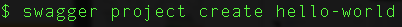
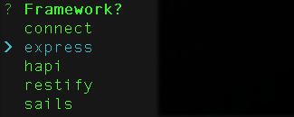
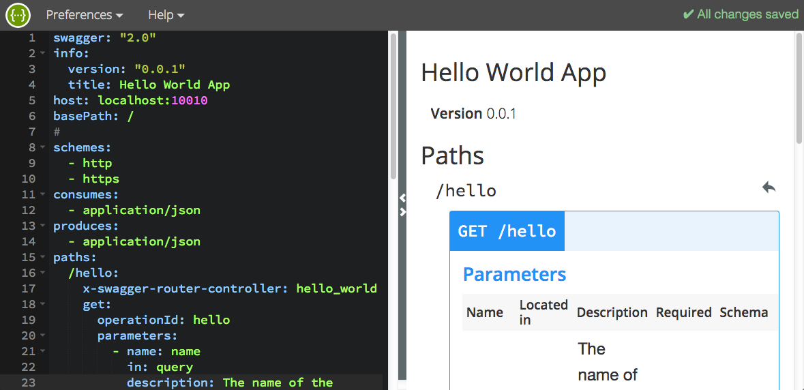
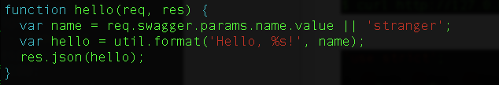

The `swagger` module provides tools for designing and building APIs entirely in Node.js. It integrates with popular Node.js servers, including Express, hapi, restify, and Sails, as well as any Connect-based middleware. With `swagger`, you can specify, build, and test your API from the very beginning, on your laptop. It allows you to change and iterate your design without rewriting the logic of your implementation.

## Install swagger

Install using npm. For complete instructions, see the [install](./docs/install.md) page. 

## Create a new swagger project

Use the [CLI](./docs/cli.md) to create and manage projects. Choose from among several popular API server frameworks. Learn more on the [quick start](./docs/quick-start.md) page. 

## Develop your API in the Swagger Editor

Interactive, browser-based, [Swagger Editor](http://editor.swagger.io/) provides Swagger 2.0 validation and endpoint routing, generates docs on the fly, and uses easy-to-read YAML. 

## Write controller code in Node.js

Code your API's business logic in Node.js, with pleasure. Learn [more](./docs/controllers.md). 

## Run the server

Run your project's server locally, or deploy it to the cloud. 

## Call the API

It just works!

# Installing the swagger module

See the [Installing swagger](https://github.com/apigee-127/swagger-node/blob/master/docs/install.md) for details. 

# Using the swagger module

Go to the [swagger module doc page](https://github.com/apigee-127/swagger-node/blob/master/docs/README.md). It includes all the information you need to get started. 

# About this project

This initiative grew out of Apigee-127, an API design-first development framework using Swagger. 
Apigee donated the code to create the swagger-node project in 2015.

/****************************************************************************
 Copyright 2015 Apigee Corporation

 Licensed under the Apache License, Version 2.0 (the "License");
 you may not use this file except in compliance with the License.
 You may obtain a copy of the License at

 http://www.apache.org/licenses/LICENSE-2.0

 Unless required by applicable law or agreed to in writing, software
 distributed under the License is distributed on an "AS IS" BASIS,
 WITHOUT WARRANTIES OR CONDITIONS OF ANY KIND, either express or implied.
 See the License for the specific language governing permissions and
 limitations under the License.
 ****************************************************************************/
