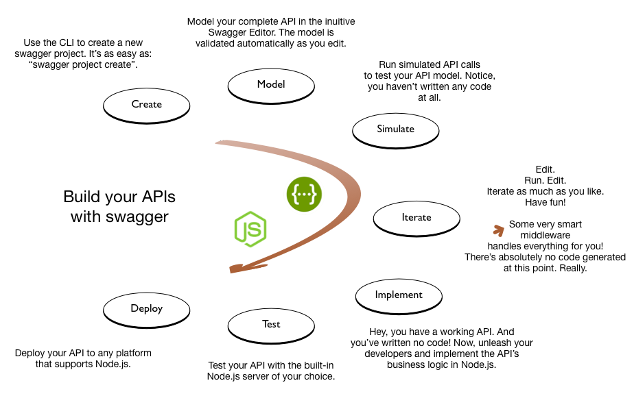

[](https://travis-ci.org/swagger-api/swagger-node)

The `swagger` module provides tools for designing and building Swagger-compliant APIs entirely in Node.js. It integrates with popular Node.js servers, including Express, hapi, restify, and Sails, as well as any Connect-based middleware. With `swagger`, you can specify, build, and test your API from the very beginning, on your laptop. It allows you to change and iterate your design without rewriting the logic of your implementation.




Remember, one great thing about this approach is that all of the Swagger validation logic is handled for you, and all of the routing logic is managed through the Swagger configuration. You don't have to code (or recode!) any of that stuff yourself.

# Your swagger API in five steps

## 1. Install the swagger module

Install using npm. For complete instructions, see the [install](./docs/install.md) page.

```bash
$ npm install -g swagger
```

## 2. Create a new swagger project

Use the [CLI](./docs/cli.md) to create and manage projects. Learn more on the [quick start](./docs/quick-start.md) page.

```bash
$ swagger project create hello-world
```

## 3. Design your API in the Swagger Editor

The interactive, browser-based [Swagger Editor](http://editor.swagger.io/) is built in. It provides Swagger 2.0 validation and endpoint routing, generates docs on the fly, and consumes easy-to-read YAML.

```bash
$ swagger project edit
```


## 4. Write controller code in Node.js

Code your API's business logic in Node.js.

```js
function hello(req, res) {
    var name = req.swagger.params.name.value || 'stranger';
    var hello = util.format('Hello, %s', name);
    res.json(hello);
}
```

If you look at the Swagger file in the editor (shown in step 3 above), the `x-swagger-router-controller` element (line 17 in the editor screenshot) specifies the name of the controller file associated with the `/hello` path. For example:

```yaml
    paths:
        /hello:
            x-swagger-router-controller: hello_world
```

Controller source code is always placed in `./api/controllers`. So, the controller source file for this project is `./api/controllers/hello_world.js`.

The `operationId` element specifies which controller function to call. In this case (line 19), it is a function called `hello`. Learn [more](./docs/controller.md).

## 5. Run the server

Run the project server.

```bash
$ swagger project start
```

## Now, call the API!

It just works!

```bash
$ curl http://127.0.0.1:10010/hello?name=Scott
"Hello, Scott!"
```

# <a name="installation"></a>Installing the swagger module

See the [Installing swagger](./docs/install.md) for details.

# <a name="using"></a>Using the swagger module

Go to the [swagger module doc page](./docs/README.md). It includes all the information you need to get started.

# <a name="about"></a>About this project

This initiative grew out of Apigee-127, an API design-first development framework using Swagger.
Apigee donated the code to create the swagger-node project in 2015.

 >Copyright 2015 Apigee Corporation

 >Licensed under the Apache License, Version 2.0 (the "License");
 you may not use this file except in compliance with the License.
 You may obtain a copy of the License at

 >http://www.apache.org/licenses/LICENSE-2.0

 >Unless required by applicable law or agreed to in writing, software
 distributed under the License is distributed on an "AS IS" BASIS,
 WITHOUT WARRANTIES OR CONDITIONS OF ANY KIND, either express or implied.
 See the License for the specific language governing permissions and
 limitations under the License.
