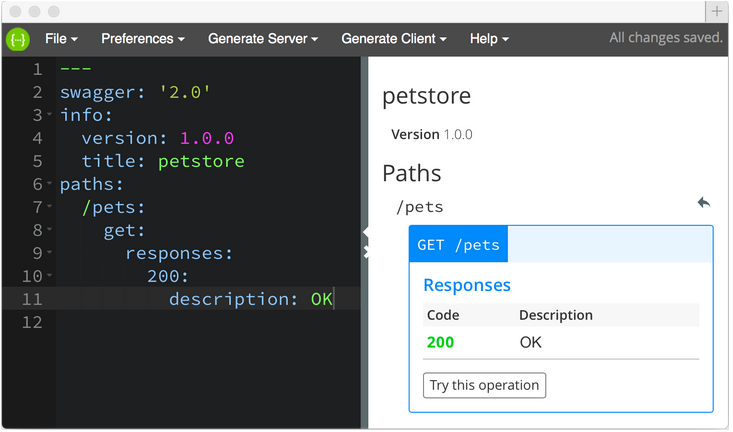

 
## Command-line interface reference

Create, run, and manage Swagger projects from the command line.

* [swagger](#swagger)
* [project create](#create)
* [project start](#start)
* [project verify](#verify)
* [project edit](#edit)
* [project open](#open)
* [project test](#test)
* [docs](#docs)

#### swagger

Options:

* -h, --help: Outputs usage information.
* -V, --version: Outputs the swagger cli version number.

Example:

    swagger -V
    0.2.0

#### swagger project create [options] [name]

Creates a folder with the specified [name] containing a new Swagger project. A project skeleton is downloaded from GitHub and installed in the new folder. 

Options:

* -h, --help: Outputs usage information.
* -f, --framework <framework>: Specifies an API framework to use with the project. Choices are connect, express, hapi, restify, or sails. 

Example:

    swagger project create -f express sn-express
    ls sn-express
    README.md  api   app.js    config    node_modules   package.json   test

#### swagger project start [options] [directory]

Starts the Swagger project in the current (or specified) directory. The server automatically restarts when you make changes to the project. You can also force a restart by typing `rs` on the server command line.

Options:

* -h, --help: Outputs usage information.
* -d, --debug <port>: Start in remote debug mode so you can connect to it with a debugger.
* -b, --debug-brk <port>: Start in remote debug mode, wait for debugger. 
* -m, --mock: Start in mock mode. For more information, see [Running in mock mode](./mock-mode.md). 
* -o, --open: Open the default browser as a client to the project. 
* -n, --node-args <args>: Pass extra arguments to node. E.g. `swagger project start --node-args "--harmony"` will run node with [ES6 a.k.a harmony features](https://github.com/joyent/node/wiki/ES6-%28a.k.a.-Harmony%29-Features-Implemented-in-V8-and-Available-in-Node) enabled.

Example:

    cd ./myproject
    swagger -m project start

#### swagger project verify [options] [project root directory]

Verifies that the project in the current (or specified) directory is correct. Reports errors and warnings from the Swagger model, project configuration, etc. 

Options:

* -h, --help: Outputs usage information.
* -j, --json: Output information in JSON format.

Example:

    cd ./myproject
    swagger project verify
    Project Errors
    --------------
    #/: Missing required property: paths
    #/: Additional properties not allowed: aths
    Results: 2 errors, 0 warnings

#### swagger project edit [options] [directory]

Opens the project in the current (or specified) directory in the [Swagger Editor](https://github.com/swagger-api/swagger-editor). 

Options:

* -h, --help: Outputs usage information.
* -s, --silent: Do not open the browser. 
* --host <host>: The hostname the editor is served from (default: 127.0.0.1).
* -p, --port <port>: The port the editor is served from (default: random port).

Example:

    cd ./myproject
    swagger project edit

#### swagger project open [directory]

Opens the browser as a client to the current or specified project. 

Options:

* -h, --help: Outputs usage information.

Example:

`swagger project open ./myproject`

#### swagger project test [options] [directory-or-file]

Runs project tests. 

Options:

* -h, --help: Outputs usage information.
* -d, --debug <port>: Start in remote debug mode so you can connect to it with a debugger.
* -b, --debug-brk <port>: Start in remote debug mode, wait for debugger. 
* -m, --mock: Start in mock mode. For more information, see [Running in mock mode](./mock-mode.md). 

Example:

    `swagger project test`
    
      controllers
        hello_world
          GET /hello
            ✓ should return a default string
            ✓ should accept a name parameter
        2 passing (27ms)

##### swagger docs

Opens the Swagger 2.0 specification in your browser. 

Example:

    swagger docs

